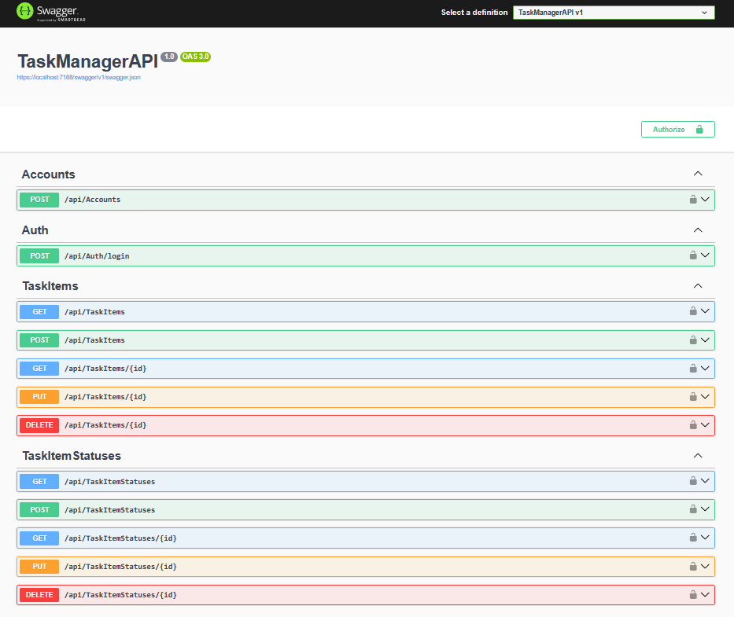
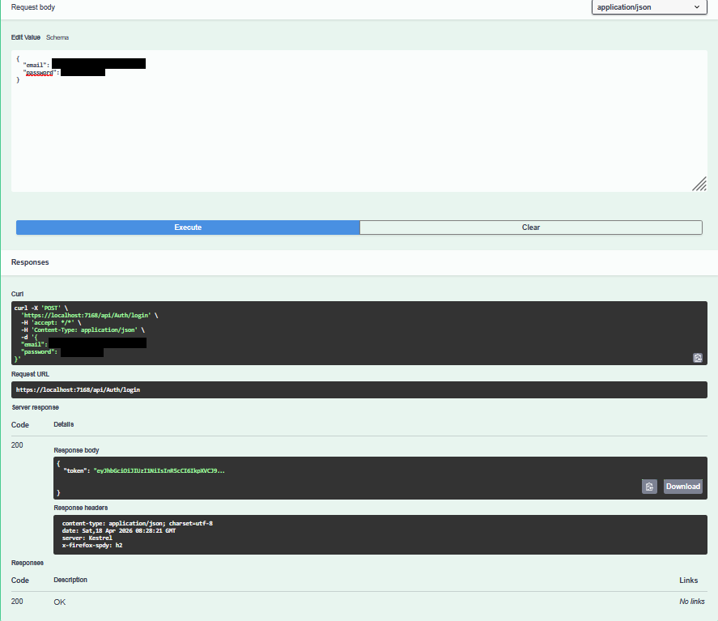
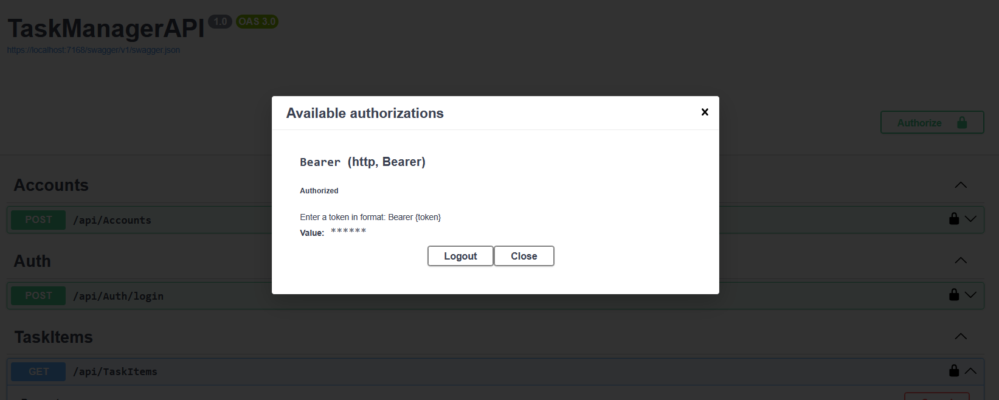
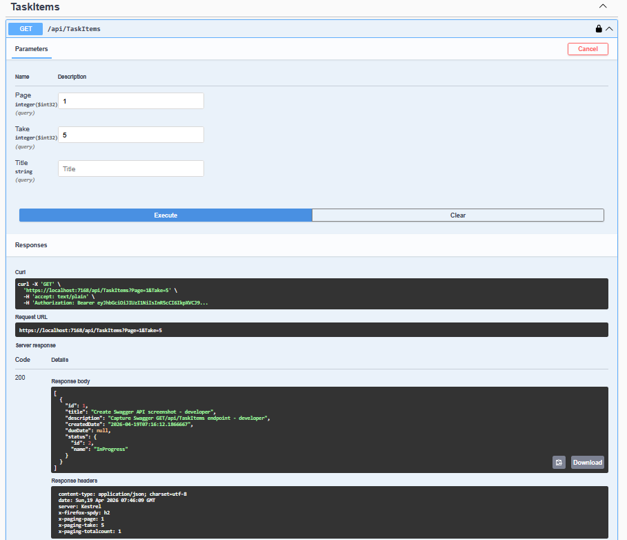
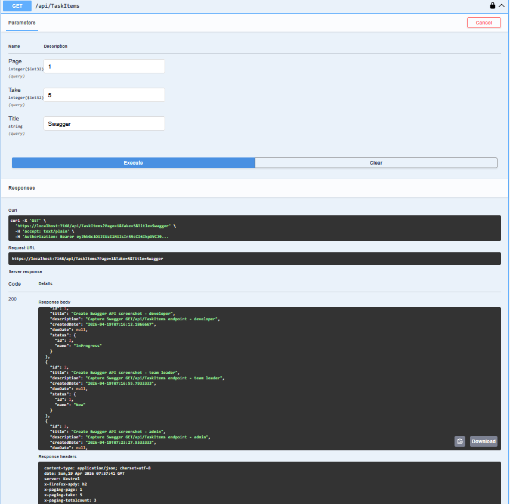

# TaskManagerAPI
RESTful ASP.NET Core Web API for managing tasks with JWT authentication, role-based authorization, and layered architecture.

## API Preview

### Swagger Overview


### Authentication (Login)


### Bearer Authorization


### Get TaskItems – Developer (Filtered)


### Get TaskItems – Admin (All Data)



## Features
- JWT authentication with ASP.NET Core Identity
- Role-based authorization (Admin, TeamLeader, Developer)
- User registration (Admin only)
- Secure password handling via ASP.NET Core Identity
- Pre-seeded users and roles
- Swagger UI with JWT authentication support
- Task management domain (TaskItem, TaskItemStatus)
- Clean layered architecture (Controller → Service → Repository)
- TaskItemStatuses management (GetAll, GetById, Create, Update, Delete)
- TaskItems management (GetAll, GetById, Create, Update, Delete)
- Custom response headers for paging metadata
- Role-based data access (Admin vs User)
- DTO mapping using AutoMapper
- FluentValidation for request validation
- Global exception handling using ProblemDetails
- Custom exception hierarchy
- Structured application logging


## Tech Stack
- ASP.NET Core Web API (.NET 9)
- Entity Framework Core
- SQL Server
- ASP.NET Core Identity
- JWT Authentication
- Swagger (Swashbuckle)
- AutoMapper
- FluentValidation

## Architecture
The project follows a layered architecture:

- Controllers – handle HTTP requests and responses
- Services – contain business logic
- Repositories – handle data access using Entity Framework Core
- Data layer – DbContext and entity configurations
- Global Exception Handler – centralized error handling and API error responses

## API Endpoints

### Authentication
- POST /api/auth/login

### Accounts (Admin only)
- POST /api/accounts

### TaskItemStatuses
Requires authentication (JWT Bearer token)

- GET /api/taskitemstatuses – get all statuses
- GET /api/taskitemstatuses/{id} – get status by id
- POST /api/taskitemstatuses – create new status
- PUT /api/taskitemstatuses/{id} – update status by id
- DELETE /api/taskitemstatuses/{id} – delete status by id

### TaskItems
Requires authentication (JWT Bearer token)

- GET /api/taskitems – get user tasks (supports paging & filtering via query params)
- GET /api/taskitems/{id} – get user task by id (only if user has access)
- POST /api/taskitems – create new task for authenticated user
- PUT /api/taskitems/{id} – update task by id (only if user has access)
- DELETE /api/taskitems/{id} – delete task by id (only if user has access)

## Authentication
This API uses JWT Bearer authentication.

To access protected endpoints:
1. Call `/api/auth/login`
2. Copy the returned JWT token
3. Use it in requests:

Authorization: Bearer {token}

## Getting Started
1. Clone repository
```bash
git clone https://github.com/martin-marinov-m/taskmanager-api.git
cd taskmanager-api
```

2. Configure environment

Update appsettings.Development.json:
- Connection string
- JWT settings
- Seeded users

3. Apply migrations

Package Manager Console:
```powershell
Update-Database
```

CLI: 
```bash
dotnet ef database update
```

4. Run the application

Swagger UI: 

`https://localhost:7168/swagger`


## Testing

The project includes integration tests using xUnit and SQLite in-memory database.

- Separate test project: `TaskManagerAPI.Tests`
- xUnit testing framework
- Uses SQLite in-memory database to simulate real relational database behavior
- Handles provider differences (SQL Server vs SQLite) for accurate testing
- Each test runs against a fresh database instance
- Covers:
 - Repository layer
 - Service layer (business logic)
 - Authorization logic (Admin vs User)
 - Paging and filtering scenarios

Run tests:

```bash
dotnet test
```

## License
This project is licensed under the MIT License.